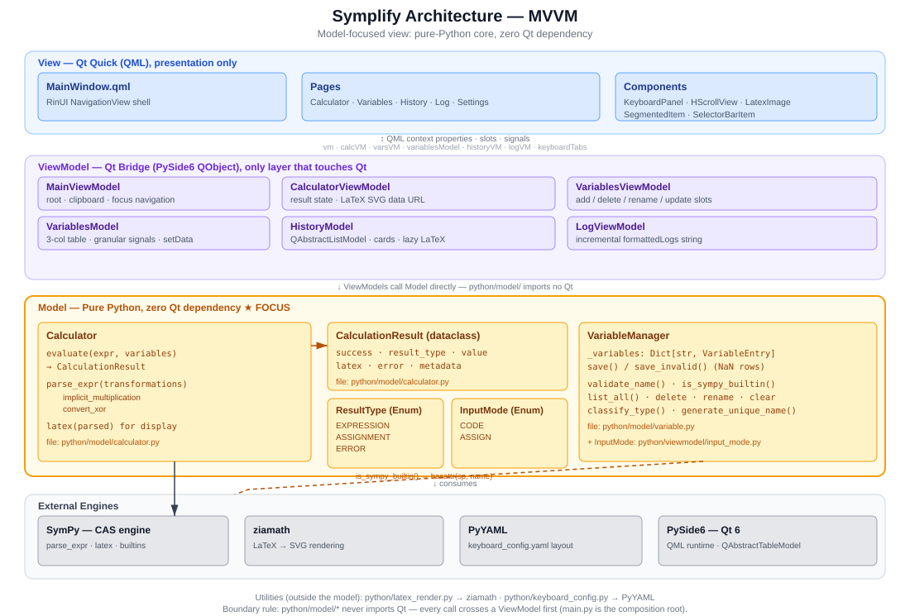

<p align="center">
  <h1 align="center">Symplify</h1>
  <p align="center">A Modern Symbolic Calculator Built with SymPy + PySide6</p>
</p>

---

Symplify is a graphical symbolic calculator that wraps SymPy's powerful CAS (Computer Algebra System) in a clean, Fluent-styled desktop UI. The interface is written in **QML (Qt Quick Controls)** using the [RinUI](https://github.com/RinLit-233-shiroko/Rin-UI) component library, with business logic kept in a pure-Python **MVVM** core that has zero Qt dependencies.

> **Status:** QML prototype. The plotting area is a placeholder; see [Roadmap](#roadmap).

## Features

- **Symbolic & Numeric Computation** — Derivatives, integrals, limits, equation solving, matrix algebra, and more via SymPy.
- **Dual Input Modes** — Toggle between **Code** (evaluate any expression) and **Assign** (variable assignment with dedicated name/operator/value fields, including `+=`, `-=`, `*=`, `/=`).
- **Variable Management** — Dedicated variables page with add/edit/delete/rename, real-time validation, and warnings when shadowing a SymPy built-in constant (`pi`, `E`, ...).
- **$\LaTeX$ Rendering** — Results rendered $\LaTeX$ via `ziamath`.
- **Keyboard Panel** — On-screen math keyboard with smart cursor positioning for Greek letters, operators, and common functions (7 tabs, YAML-configurable).
- **History & Log** — Calculation history with copy-to-clipboard; scrollable log with info/warning/error levels.
- **Focus Navigation** — `Ctrl+Tab` / `Ctrl+Shift+Tab` cycle focus through the UI.

## Quick Start

### Prerequisites

- Python 3.11+
- [uv](https://docs.astral.sh/uv/) (recommended) or pip

### Installation & Run

```bash
git clone https://github.com/I-AM-A-NOOB/Symplify.git
cd Symplify

uv sync          # or: pip install -e .
python main.py
```

## Architecture

Symplify follows **MVVM**. The `python/` package is split into three layers; the model is pure Python with no Qt imports, which keeps it unit-testable and independent of any UI framework.



- **Model** (`python/model/`) — Pure business logic: `Calculator` (SymPy evaluation), `VariableManager` (in-memory variable store with a revision counter for cache invalidation), `InputMode` / `ResultType` enums, and the `CalculationResult` dataclass. Zero Qt dependency.
- **ViewModel** (`python/viewmodel/`) — Qt bridge layer. `QObject` subclasses expose properties, signals, and slots to QML; `QAbstractTableModel`s back the variables/history tables. Also contains the `latex_render` (ziamath) and `keyboard_config` (YAML) helpers.
- **View** (`qml/`) — Qt Quick UI only: a `FluentWindow` with RinUI's `NavigationView`, the five pages, and the `KeyboardPanel`. No business logic.
- **Composition root** (`main.py`) — Builds `MainViewModel`, registers the viewmodels as flat QML context properties (`vm`, `calcVM`, `varsVM`, `historyVM`, `logVM`, `variablesModel`, `keyboardTabs`), and starts the QML engine via RinUI's `RinUIWindow`.

A request flows: **QML event → ViewModel slot → Model → SymPy → result → LaTeX/SVG → QML**. A detailed walkthrough lives in [`docs/architecture.md`](docs/architecture.md).

## Project Structure

```
main.py                        # Entry point (composition root)
python/
  model/                       # Pure business logic, zero Qt
    calculator.py              #   Calculator, CalculationResult, ResultType
    variable.py                #   VariableManager
    input_mode.py              #   InputMode (CODE / ASSIGN)
  viewmodel/                   # Qt bridge (QObject + QAbstractTableModel)
    main_viewmodel.py          #   Root VM, aggregates all children
    calculator_viewmodel.py    #   Result state, LaTeX SVG, calculate slots
    variables_viewmodel.py     #   CRUD slots + VariablesModel table
    history_viewmodel.py       #   HistoryModel table
    log_viewmodel.py           #   LogViewModel
  latex_render.py              # LaTeX -> SVG via ziamath
  keyboard_config.py           # Keyboard layout from keyboard_config.yaml
qml/
  MainWindow.qml               # FluentWindow + RinUI navigation
  components/                  # KeyboardPanel
  pages/                       # Calculator, Variables, History, Log, Settings
docs/
  architecture.svg             # Architecture diagram (model-focused)
  architecture.md              # Architecture walkthrough
test_plot.py                   # Experimental SymPy->GLSL GPU plotting prototype
```

## Usage

### Code Mode

Type any valid SymPy expression and press **Ctrl+Return** (or click **Calculate**):

| Expression | Result |
|---|---|
| `diff(x**2, x)` | $2x$ |
| `integrate(sin(x), x)` | $-\cos(x)$ |
| `limit(sin(x)/x, x, 0)` | $1$ |
| `solve(x**2 - 4, x)` | $[-2, 2]$ |
| `Matrix([[1,2],[3,4]]).det()` | $-2$ |

### Assign Mode

Switch to Assign mode via the mode selector. A two-segment input appears:

```text
[ variable name ]  [ ▼ = ]  [ expression ]
```

Type your variable name, then press `=` to jump to the value field. The operator dropdown also supports `+=`, `-=`, `*=`, `/=` for augmented assignments. Press **Ctrl+Return** to assign.

Assigning to a SymPy built-in constant (like `pi` or `E`) triggers a friendly warning — you can proceed, but you've been warned.

### Variable Manager

Use the Variables page (left navigation bar) to view, add, edit, delete, or rename stored variables. Values are parsed as SymPy expressions, so variables can reference each other.

### Keyboard Panel

Click the on-screen keyboard to insert functions, Greek letters, operators, and digits. The cursor auto-positions inside function parentheses (e.g., `sin(|)`). The layout is defined in `python/keyboard_config.yaml`.

## Dependencies

| Package | Purpose | License |
|---|---|---|
| [PySide6](https://doc.qt.io/qtforpython-6/) | Qt 6 for Python (QML runtime, Qt Quick Controls) | LGPLv3 |
| [RinUI](https://github.com/RinLit-233-shiroko/Rin-UI) | Fluent Design-like QML component library | MIT |
| [SymPy](https://sympy.org) | Symbolic mathematics engine | BSD |
| [ziamath](https://github.com/vvandijck/ziamath) | LaTeX to SVG math rendering | MIT |
| [PyYAML](https://pyyaml.org) | Keyboard layout config | MIT |

## Roadmap

- Wire the plot area to a real plotting backend (`test_plot.py` is an exploratory SymPy→GLSL GPU prototype).
- Extend the settings page (theme mode and Windows backdrop effect are wired; accent color and LaTeX size are not).
- Add persistence for variables and history.
- Add an automated test suite (`pytest`) around `python/model`.

## License

Symplify is licensed under [GPLv3](LICENSE).
