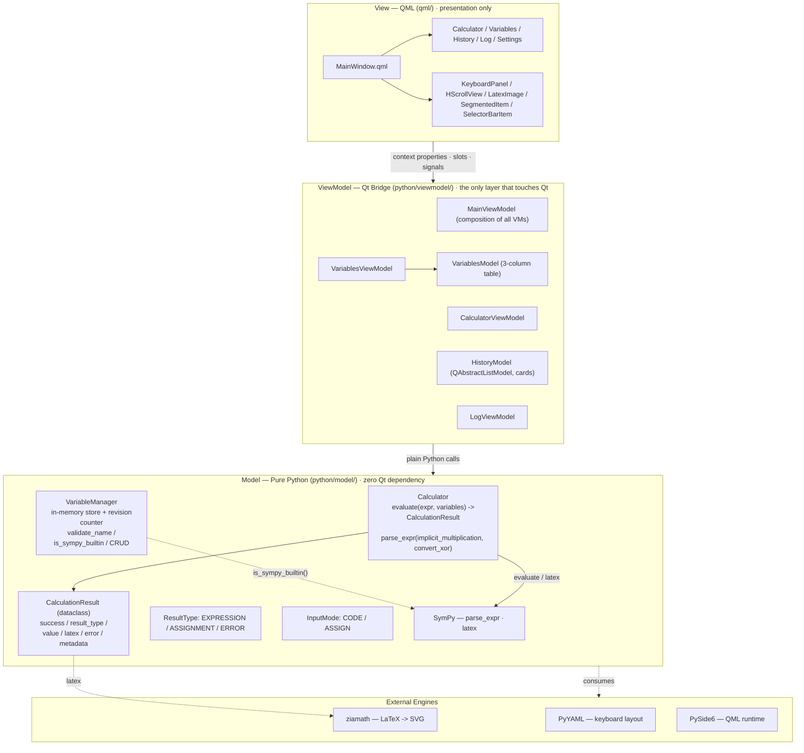

# Symplify Architecture

See [`architecture.svg`](architecture.svg) for the model-focused diagram. This page is a text walkthrough of the same design, kept in sync with the code.

## MVVM layering



## The model layer (focus)

Everything under `python/model/` is plain Python: no `PySide6`, no `QObject`, no view concerns. It can be imported, reasoned about, and unit-tested in isolation.

### `Calculator` — `python/model/calculator.py`

The symbolic engine. It exposes a single entry point:

```python
def evaluate(self, expression: str, variables: dict | None) -> CalculationResult
```

- Parses the input with `sympy.parsing.sympy_parser.parse_expr`, enabling `implicit_multiplication` (`2x` == `2*x`) and `convert_xor` (`x**2` == `x^2`).
- Takes the current variable store (`variables`) as a `local_dict` so expressions can reference saved variables.
- Never raises: any parse/evaluation exception is captured and returned as a `CalculationResult` with `success=False`.

### `CalculationResult` — dataclass in `calculator.py`

The single carrier between Model and ViewModel:

| Field | Meaning |
|---|---|
| `success` | Whether evaluation succeeded |
| `result_type` | `ResultType.EXPRESSION` / `ASSIGNMENT` / `ERROR` |
| `value` | The resulting SymPy object (or `None` on error) |
| `latex` | `sympy.latex(value)` for display |
| `error` | Error message when `success is False` |
| `metadata` | Optional extra info |

### `VariableManager` — `python/model/variable.py`

The in-memory variable store keeps **snapshot entries** (`VariableEntry`):

- `_variables: Dict[str, VariableEntry]` holds name → entry, where each entry carries the sympy object, its display expression string, a coarse type label, and a validity flag. `save(name, value)` stores a valid snapshot; `save_invalid(name, raw)` keeps failed input as an `NaN` entry instead of dropping it.
- `list_all()` returns only the valid variables (as name → sympy value) for evaluation.
- `validate_name(name)` enforces identifier rules (first char alpha/underscore, alnum/underscore after, no Python keywords).
- `is_sympy_builtin(name)` checks against known constants (`pi`, `E`, `I`, `oo`, ...) plus a generic `hasattr(sympy, name)` probe, so assigning a variable that shadows a SymPy name raises a UI warning.
- `classify_type(value)` maps sympy objects to coarse labels (`Integer`, `Expression`, `Matrix`, ...) with a raw class-name fallback.
- CRUD: `save` / `save_invalid` / `delete` / `rename` / `clear` / `exists` / `list_all`, plus `generate_unique_name(base)` for auto-naming.

### Enums

- `InputMode` (`input_mode.py`) — `CODE` (evaluate an expression) / `ASSIGN` (assign to a variable).
- `ResultType` (`calculator.py`) — `EXPRESSION` / `ASSIGNMENT` / `ERROR`.

## Boundary rule

The project convention: **`python/model/*` never imports Qt.** Every call from the UI crosses a ViewModel first, and every result comes back as plain data (`CalculationResult`). `main.py` is the composition root — it builds `MainViewModel`, wires the shared `Calculator` and `VariableManager` into the ViewModels, and registers them as flat QML context properties.

## Request flow

```text
QML key press / button click
   -> ViewModel slot (e.g. CalculatorViewModel.calculate)
   -> Calculator.evaluate(expr, VariableManager.list_all())
   -> SymPy parse + latex
   -> CalculationResult back to ViewModel
   -> _apply_result: sets resultText / resultLatex / latexSvgUrl (via latex_render -> ziamath)
   -> resultChanged signal -> QML binding updates the view
```

History (`HistoryModel.add_item`) and log (`LogViewModel.add_info/add_error`) are written alongside each calculation, so every operation is traceable.
