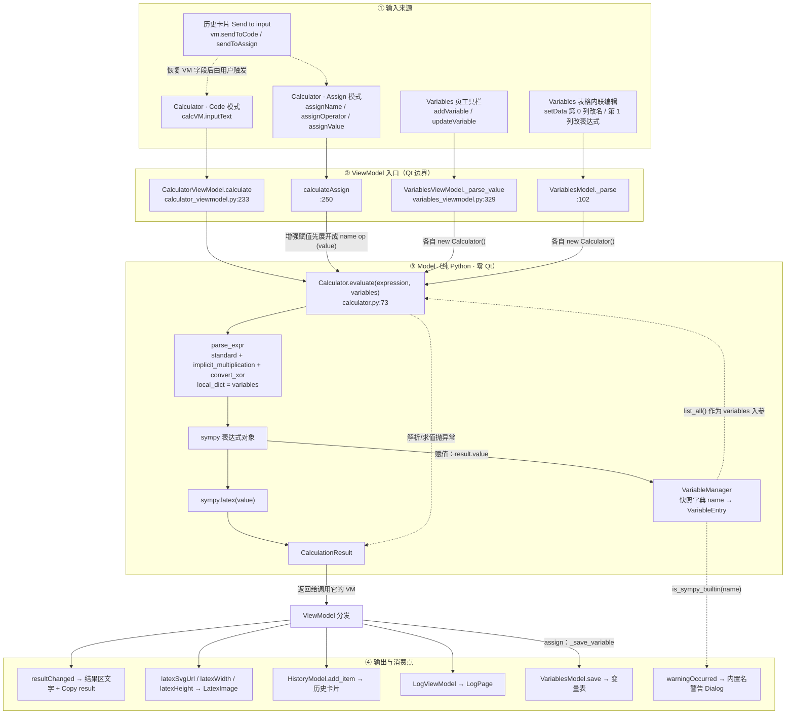
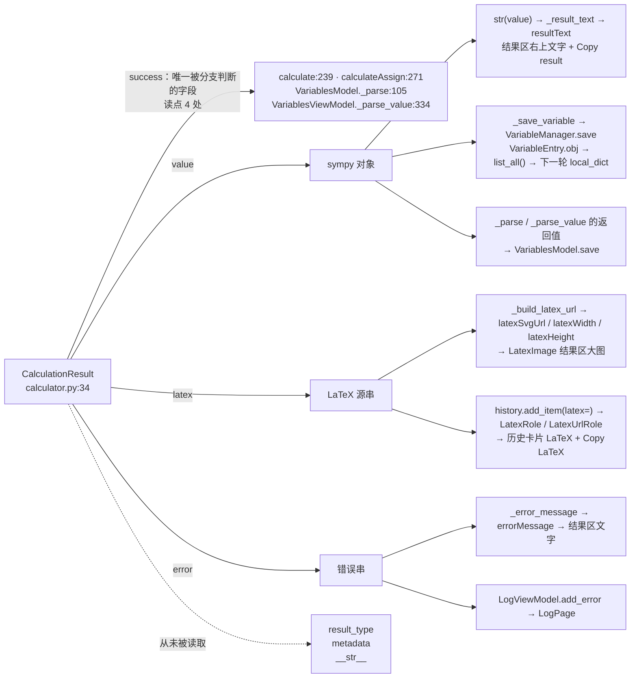

# Symplify Architecture — the calculation Model and its data flow

This page is **Model-first**: it documents the pure-Python calculation core
(`python/model/`), where its inputs come from, and who reads each field of what
it hands back. The static layer/type map lives in [`architecture.svg`](architecture.svg);
this page is about how data actually moves.

## The Model in one sentence

`Calculator.evaluate(expression, variables) -> CalculationResult` — **one entry
point, zero Qt, never raises**. Everything else in `python/model/` exists either
to feed it (`VariableManager`) or to describe what came back
(`CalculationResult`). Any change to the calculation behaviour belongs there,
and only there.

## 1. Data flow: sources in, sinks out



What the diagram is saying:

- **Four entry points converge on one function.** Code mode
  (`CalculatorViewModel.calculate`), Assign mode (`calculateAssign`, which first
  expands `+= -= *= /= %=` into the expression `name <op> (value)`), the
  Variables-page toolbar, and the Variables table's inline edit all end at
  `Calculator.evaluate`. The first two use the shared `Calculator` instance from
  `MainViewModel`; the two Variables paths build a throwaway `Calculator()` each.
- **`variables` is the second input channel.** `VariableManager.list_all()`
  (valid entries only) becomes `parse_expr`'s `local_dict`, so saved variables
  resolve as symbols; expressions that reference unknown names stay symbolic.
- **`result.value` is the only output that flows back in.** Assign mode stores
  the sympy object as a `VariableEntry`, and the next evaluation reads it back
  through `list_all()` — the closed loop in the middle of the diagram. History,
  log and the result area are terminal consumers.
- **Text and LaTeX are terminal.** `str(value)` feeds the result line and the
  clipboard; the LaTeX source feeds the rendered result image and the history
  entry (which re-renders lazily on its own).

## 2. `CalculationResult`: every field, and who reads it



| Field | Written at | Read at | Reaches the UI as |
|---|---|---|---|
| `success` | `calculator.py:91` / `:98` | 4 call sites (both VMs) | the branch that decides result vs. error |
| `value` | `calculator.py:93` | `calculator_viewmodel.py:217`, `:244`, `:281`; `variables_viewmodel.py:107`, `:336` | `resultText`, the variables table, the next evaluation |
| `latex` | `calculator.py:94` | `calculator_viewmodel.py:218`, `:221`, `:242`, `:277` | the rendered result image, `Copy LaTeX`, the history card |
| `error` | `calculator.py:98` | `calculator_viewmodel.py:226`, `:247`, `:285`; `variables_viewmodel.py:106`, `:335` | the error text in the result area, the log |
| `result_type` | `calculator.py:92` / `:98` | **nothing** | — (`ResultType.ASSIGNMENT` is never even produced) |
| `metadata` | never | **nothing** | — |

Two more members of the same family, outside this dataclass:

- `CalculationResult.__str__` (`calculator.py:54`) — no callers; both VMs use
  `str(result.value)`.
- `CalculatorViewModel.displayText` (`calculator_viewmodel.py:197`) — declared to
  "cut QML→Python round-trips" by merging error/LaTeX, but no QML binds it; the
  result area reads `isError` + `errorMessage` + `resultText` instead.

## 3. `VariableManager` — a snapshot store, not a dependency graph

- Entries are **snapshots**: an assignment stores the sympy object it evaluated
  to at that moment. Nothing is re-evaluated when the sources of an expression
  change, and there is no dependency tracking.
- A failed assignment (`=` in Assign mode, or an unparsable inline edit) is kept
  as an **invalid (NaN) entry** (`save_invalid`) so the user's raw input — and
  its row — survives; `list_all()` excludes those entries from evaluation.
- `validate_name` enforces identifier rules (leading letter/underscore, then
  alnum/underscore, not a Python keyword). It runs **late** — inside
  `save`/`save_invalid`, not in the UI or the ViewModel — so an illegal name like
  `1x` still evaluates, still lands in history, and only fails to be stored
  (logged as a warning by `_save_variable`).
- `is_sympy_builtin` (known constants plus a generic `hasattr(sympy, name)`
  probe) drives the "… is a SymPy built-in. You asked for it." warning dialog; it
  is checked by both the calculator and the variables ViewModels.
- `classify_type` maps a sympy object to the coarse type label shown in the
  table's third column; `VariableEntry.expr_str` (the canonical `str(obj)`, or
  the raw input when invalid) is the second column.
- `revision` / `_touch` exist for cache invalidation but **have no readers**, and
  `VariablesModel.InvalidRole` (exposed to QML as `invalid`) is unused as well —
  invalid rows are recognisable in the UI only through their `Invalid` type label.

## 4. Boundary rule

**`python/model/*` never imports Qt.** Every call from the UI crosses a
ViewModel first, and every result comes back as plain data
(`CalculationResult` / `VariableEntry`). `main.py` is the composition root: it
builds `MainViewModel`, wires the shared `Calculator` and `VariableManager` into
the ViewModels, and registers them as flat QML context properties.

The Model also decides **nothing about display**: rendering (`latex_render.py`),
theme colouring, clipboard and focus navigation all live in the ViewModel or
above. That is why the Model can be exercised headless:

```bash
uv run python -c "from python.viewmodel.main_viewmodel import MainViewModel; \
vm=MainViewModel(); vm.calculator.calculate('diff(x**2, x)'); print(vm.calculator._result_text)"
```
