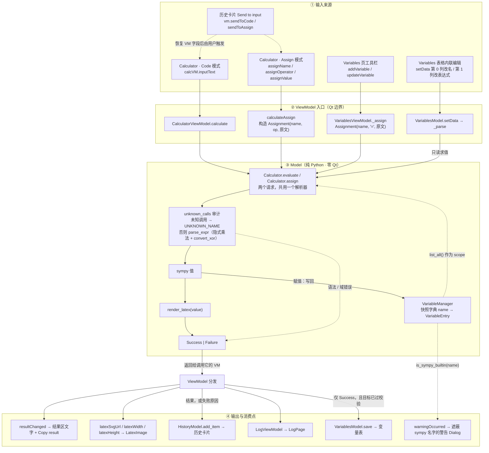
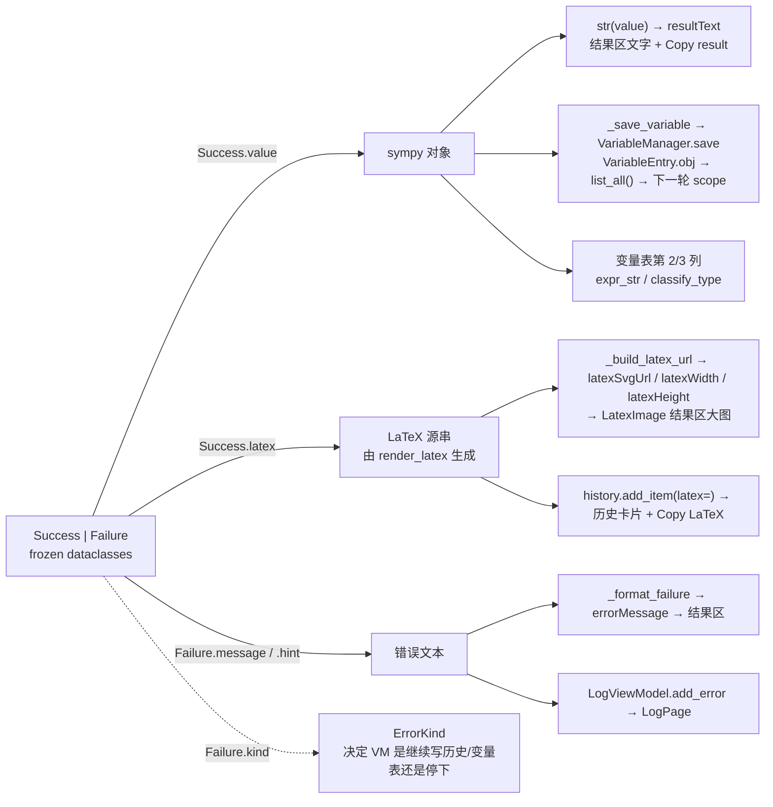

# Symplify Architecture — the calculation Model and its data flow

This page is **Model-first**: it documents the pure-Python calculation core
(`python/model/`), the two requests it answers, where those requests come from,
and who reads what comes back. The static layer/type map lives in
[`architecture.svg`](architecture.svg); this page is about how data actually moves.

## The Model in one sentence

Two requests, one parser, no Qt:

```python
Calculator.evaluate(expression, scope)      -> Success | Failure   # read
Calculator.assign(Assignment(target, op, expression), scope) -> Success | Failure   # write
```

`Calculator` owns what an input *means* — which syntax is accepted, which names
resolve, what counts as a failure. Nothing above it may re-implement that, and
the Model decides nothing about display.

## 1. Data flow: sources in, sinks out



What the diagram is saying:

- **Four UI routes, two model requests.** Code mode, Assign mode, the Variables
  toolbar and the table's inline edit all end in `evaluate` (read) or `assign`
  (write); no route assembles an expression string of its own any more.
- **`scope` is the second input channel.** `VariableManager.list_all()` (valid
  entries only) is handed to `parse_expr` as `local_dict`, so saved variables
  resolve as symbols; names that resolve to nothing stay symbolic.
- **The write path is validated before anything happens.** `assign` rejects a bad
  target or a missing augmented-assignment target *before* evaluating, so a
  rejected write cannot leave a variable or a success log line behind. What it
  *does* leave is an error card in the history — marked as an error, never as a
  result — because the input is what the user needs in order to fix it.
- **`Success.value` is the only output that flows back in.** Assign mode stores
  the sympy object as a `VariableEntry`, and the next request reads it back
  through `list_all()` — the closed loop in the middle of the diagram.
- **Text and LaTeX are terminal.** `str(value)` feeds the result line and the
  clipboard; the LaTeX source feeds the rendered image and the history entry
  (which re-renders lazily on its own).
- **Failures are history too.** A failed request is recorded with its input
  (name/op/expression for assignments) and the failure text, so the card can
  show the reason and *Send to input* can put the expression back to be fixed.
  The `error` role is what makes a card render as an error card.

## 2. What comes back: `Success` or `Failure`



| Shape | Fields | Read by |
|---|---|---|
| `Success` | `expression`, `value`, `latex` | `value` → the result line, the variable store, the next evaluation; `latex` → the result image and the history card; `expression` → provenance |
| `Failure` | `expression`, `kind`, `message`, `hint` | `message` + `hint` → the result area, the log and the history card; `kind` → which follow-up writes are allowed |

Both are frozen dataclasses, so a caller cannot half-fill a result. The old
`CalculationResult` flag-and-payload struct is gone, and with it the members
nothing ever read (`result_type`, `metadata`, `__str__`, the `displayText`
property, `VariableManager.revision`, `VariablesModel.InvalidRole`).

### Error kinds

| Kind | Meaning |
|---|---|
| `SYNTAX` | the text is not parseable as an expression |
| `UNKNOWN_NAME` | a name used as a call that resolves to no function, or an augmented assignment whose target does not exist |
| `INVALID_NAME` | an assignment target that is not a legal variable name |
| `UNSUPPORTED` | a well-formed request the model does not implement (e.g. `**=`) |
| `INTERNAL` | sympy raised a domain error — never the user's typo |

Every kind is produced somewhere; none is declared speculatively.

## 3. The language rules the Model enforces

**Unknown calls are reported, not rewritten.** `implicit_multiplication` cannot
tell a call from juxtaposition, so it silently turns `bar(2)` into `2*bar`.
`Calculator.unknown_calls` audits the text first and returns `UNKNOWN_NAME` with
a `difflib` suggestion (`sovle(…)` → "did you mean 'solve'?"). Names that *are*
in `scope` are exempt: `f(x)` with `f` a value stays multiplication, which is the
documented meaning of juxtaposition.

**Permissions are otherwise deliberately indulged** (and locked by tests):
unknown *symbols* stay symbolic, `2x` and `x^2` work, `Matrix(...)` is reachable,
and a variable may shadow a sympy name — `sin = 5` makes `sin(x)` mean `5*x`.
That last one is a choice, not an accident; `is_sympy_builtin` warns about it
instead of refusing it.

**Names have one definition.** `validate_name` and `is_sympy_name` are module
functions in `variable.py` used by both the store and the request layer, so the
UI and the Model cannot disagree about what a legal or reserved name is.

## 4. `Assignment`: the only write path

```python
Assignment(target="y", op="+=", expression="2y")
```

- `expression` stays **text**, so the expression language is parsed by exactly
  one parser. The previous implementation rebuilt the write as the string
  `f"{name} {op[0]} ({value})"`, which turned `x += 1` on an undefined `x` into
  the self-referential binding `x = x + 1`.
- Augmented operators (`+= -= *= /= %=`) require the target to exist
  (`UNKNOWN_NAME` otherwise) and combine the stored value with the parsed
  right-hand side — node to node, never text to text.
- The target is validated *first*, which is why an invalid name now produces
  nothing at all instead of "success in the history, absent in the table".

## 5. `VariableManager` — a snapshot store, not a dependency graph

- Entries are **snapshots**: an assignment stores the sympy object it evaluated
  to at that moment. Nothing is re-evaluated when the sources of an expression
  change, and there is no dependency tracking.
- A failed *value* is kept as an **invalid (NaN) entry** (`save_invalid`) so the
  user's raw input — and its row — survives; `list_all()` excludes those entries.
  A failed *name* is not stored at all.
- `classify_type` gives the table's third column (`Integer`, `Matrix`,
  `Invalid`, …); `VariableEntry.expr_str` gives the second.
- `rename` rebuilds the store in order, so a rename keeps the entry's position
  and the table's row order never disagrees with the store's.

## 6. Boundary rule and how to check it

**`python/model/*` never imports Qt.** Every call from the UI crosses a
ViewModel first, and every result comes back as plain data. `main.py` is the
composition root: it builds `MainViewModel`, wires the shared `Calculator` and
`VariableManager` into the ViewModels, and registers them as flat QML context
properties.

The behaviour contract is locked by tests (no framework needed):

```bash
uv run python -m tests.test_model      # model + viewmodels, ~3s
```

They cover the expression language, the error kinds, the assignment rules, the
name tables and the ViewModel invariants (a rejected write leaves nothing
behind). Run them before and after touching the parser or the write path.

## Where settings live (outside the Model)

The Model never sees a settings file. Appearance, rendering and window geometry are
owned by `python/settings.py` (location + YAML + validation) and
`SettingsViewModel`, and RinUI's own theme/backdrop persistence is taken over by
`python/rinui_bootstrap.py` — see "Settings & config" in the developer guide. The
only setting the Model touches is the LaTeX font size, which the viewmodels pass to
`latex_to_svg(size=...)` when they render.
